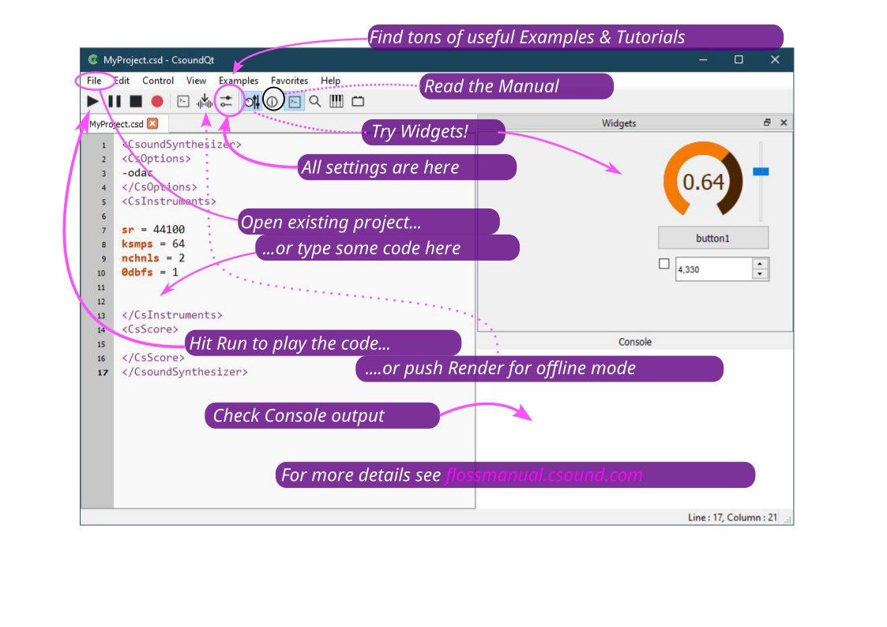
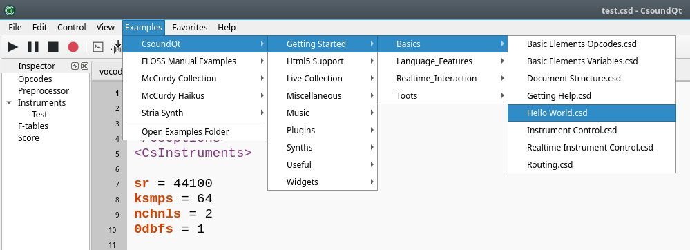
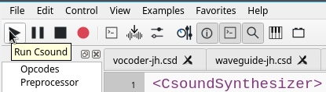
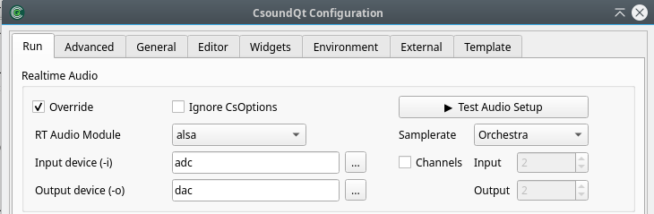

# 2. Premier lancement et dépannage

Après l’installation de Csound et CsoundQt, lancez CsoundQt. Vous verrez un éditeur comportant différents onglets.

## 2.1 Exécutez quelques exemples

Naviguez vers l’exemple _Hello World_ dans le tutoriel _Getting Started_ de CsoundQt

Une fois ce fichier chargé, pressez le bouton _Run Csound_ en haut à gauche :

Vous devriez alors entendre une seconde d’onde sinusoïdale à 440 Hz.

## 2.2 Dépannage

Et si ce n’est pas le cas ? Quelques suggestions ici ; d’autres plus tard.

- Avez-vous vraiment installé Csound **d’abord**, puis CsoundQt ? Sinon, CsoundQt ne pourra pas appeler le moteur audio de Csound.
- Regardez dans la console. (Si elle n’est pas visible, aller à _Vue > Console de sortie_.). Y a-t-il des messages d’erreur que vous pouvez comprendre ?
- Ouvrez le _panneau de Configuration_ en cliquant sur le bouton correspondant dans la barre d’outils. Regardez dans le premier onglet nommé _Exécuter_.

Dans la section _Audio en temps-réel_, vous devriez voir un pilote audio sélectionné. Si ce champ est vide, choisissez en un dans le menu déroulant. "Portaudio" devrait fonctionner sur toutes les plateformes.

Le champ _périphérique d’entrée (-i)_ est habituellement défini sur _adc_ tandis que le champ _Output device (-o)_ sur dac, comme indiqué sur l’image précédente.