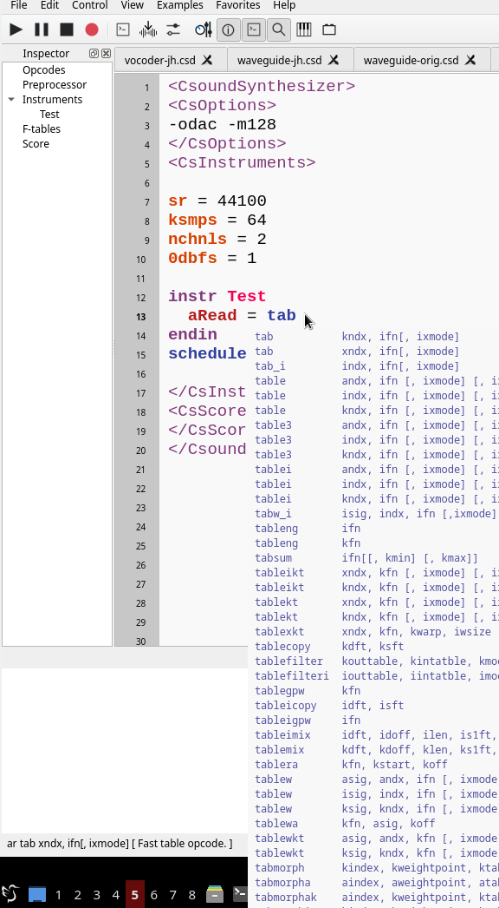

# 3. Édition et obtention d’aide
Vous pouvez trouvez une courte description de tous les éléments de Menu dans la section [Menu](Menu.md) de cette documentation. Cette page se concentre sur quelques fonctionnalités de l’éditeur de CsoundQt.

## 3.1 Complétion de code
Quand vous tapez par exemple les lettres "tab", vous voyez différentes option pour la complétion de code :



Choisissez l’une d’entre elles avec la souris ou les touches fléchées. Ensuite vous avez deux possibilités :
- **tab** complètera uniquement le nom de l’opcode,
- **return** insèrera aussi les arguments avec les noms trouvés dans le manuel.

Tous vos noms de variables personnelles offriront également l’autocomplétion.

## 3.2 Accès au manuel de Csound

Quand vous sélectionnez un opcode (double-clic sur lui), ou que le curseur est à l’intérieur, vous pouvez obtenir la page correspondante du Manuel Canonique de Csound en sélectionnant, soit _Aide > Opcode Entry_ (ou Shift+F1), soit _aide de l’opcode_ dans le menu contextuel (que vous obtenez avec le bouton droit sur le nom de l’opcode).


Vous pouvez aussi voir un courte information au sujet de l’opcode en bas du panneau de l’éditeur.

## 3.3 Graphique du code

Sélectionnez _Exemples > CsoundQt > Getting Started > Toots > Toot 1_, puis _Vue > Voir le graphique du code_. Vous devriez voir ce dessin :


Ce n’est pas parfait, mais tout de même très utile pour visualiser le flux de signal dans un fichier csd simple. Si ça ne fonctionne pas, essayez de configurer l’application graphviz dot dans _Configuration > External > Dot_.

## 3.4 Inspecteur

Quand vous cliquez sur le bouton _Montrer l’inspecteur_ (icon en forme de loupe) (ou _Vue > Inspecteur_), vous obtenez un panneau très utile dans le cas de code Csound très long :


La navigation vers toute partie du code est alors rendue plus aisée.

# 3.5 Vue fractionnée

En plus du mode texte brut habituel, CsoundQt offre une vue divisée pour, d’une part l’orchestre, et d’autre part la partition (score). Allez à _Vue > Diviser la vue_ et vous verrez la partition/score s’afficher sous forme de tableau, et que les balises (CsOptions, etc.) ont disparu. Vous pouvez choisir quelles sections afficher ou cacher :


# 3.6 Recompiler/Évaluer du code Python

Depuis Csound 6, il est possible de changer toute définition d’instrument pendant l’exécution. CsoundQt fournit un moyen facile pour recompiler. Voici par exemple votre code Csound :
```
instr 1
    schedkwhen metro(1), 0, 0, 2, 0, 1
endin
instr 2
    prints "Hallo\n"
endin
schedule(1,0,1000)
```

Exécutez ce code et remplacez l’instruction d’impression dans l’instrument 2 par "Bonjour\n" ou "BonjourBonjour\n" ou toute autre valeur de votre choix. Rien ne se produira, car Csound a besoin d’une commande pour recompiler l’instrument 2. Maintenant placez le curseur n’importe où dans l’instrument 2, allez dans le menu Edition, et sélectionnez _Évaluer la section_. Vous verrez un message dans la console : "Csound code evaluated.", et après ce message, vous verrez la nouvelle impression.