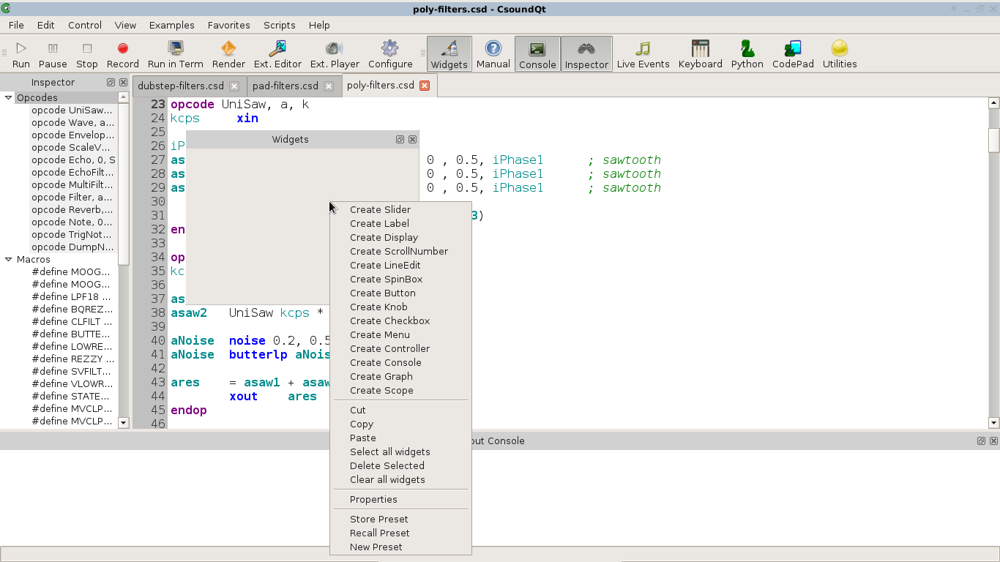
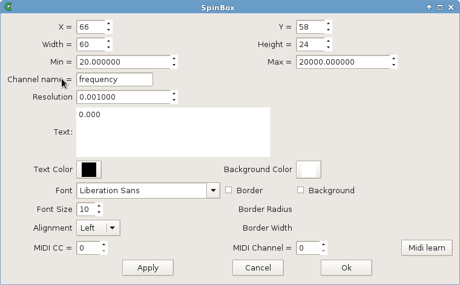
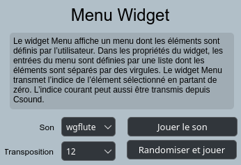
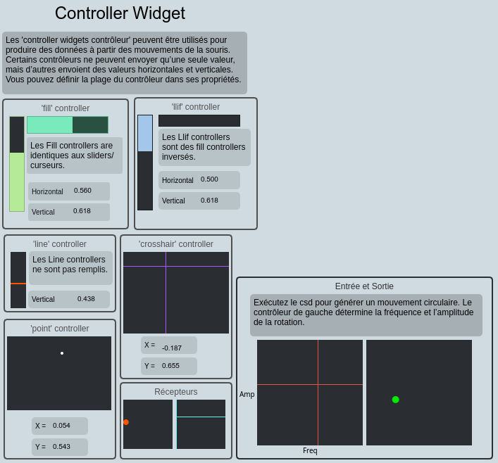

# 5. Widgets

CsoundQt offre un ensemble de widgets pour créer un Interface Graphique Utilisateur (Graphical User Interface(GUI)). Les widgets peuvent être utilisés pour afficher en temps réel ce qui se passe pendant une performance, ou pour contrôler la performance elle-même. Si CsoundQt a été construit avec RtMIDI, un widget peut être directement connecté à un contrôleur MIDI.

Vous trouverez une documentation intégrée des widgets dans les exemples de CsoundQt _Exemples > CsoundQt > Widgets_. En plus de la description donnée ici, il est recommandé de les lire et les expérimenter à la souris.


## 5.1 Création d’un widget

Ouvrez le panneau _widget_ (en cliquant le bouton widget ou en allant à _Vue > Widgets_), et cliquez-le avec le bouton droit. Vous obtiendrez un menu contextuel :



Choisissez un widget, par exemple une _SpinBox_. Vous obtiendrez un panneau avec les propriétés du widget :


- x/y – position absolue dans le panneau en pixels.
- Largeur/Hauteur – Taille du widget en pixel.
- Min/Max – Valeur minimum et maximum pour le nombre retourné par le widget.
- Resolution – La plus fine résolution des nombres (Si réglé à 1, vous n’obtiendrez que des entiers).
- Texte – La valeur actuelle (généralement définie par l’utilisateur en temps réel)
- Couleur du texte et du fond (background) – Cliquer sur ces boutons ouvre une boite de dialogue pour définir ces couleurs.

## 5.2 Mode Édition et mode Lecture

Une fois le bouton _OK_ cliqué, vous verrez la SpinBox dans le panneau de widget. Si vous voulez changer sa position, allez à _Edition > Mode édition de widget_ (Ctrl+E).


Quand le mode Edition est activé, vous pouvez déplacer les widgets ou changer leur taille en faisant glisser leur coin inférieur droit.

Comme dans [PD](https://puredata.info/) ou [Max](https://cycling74.com/products/max), vous pouvez passer d’un mode à l’autre quand vous voulez. Si vous voulez changer l’une des propriétés d’un widget, double-cliquez sur lui en mode édition, ou cliquez-droite sur lui en mode lecture, et choisissez _propriétés_.

En mode lecture, vous pouvez changer les valeurs du widget avec la souris et/ou avec le clavier de l’ordinateur. Notez qu’une nouvelle valeur dans la SpinBox ne sera active qu’après appui sur la touche Return.

## 5.3 Obtenir des valeurs à partir d’un widget

Les widgets communiquent avec Csound par un nom de canal. Comme montré ci-dessus, vous définissez ce nom de canal dans les propriétés du widget. Choisissez un nom significatif :



Vous pouvez recevoir les valeurs d’un widget via deux opcodes : `invalue` ou `chnget`. Si le canal du widget se nomme "frequency" (dans les propriétés, vous l’avez tapé sans les guillemets, mais c’est tout de même une string/chaine de caractères), la ligne de code Csound pour appeler cette valeur serait  
soit :
```
kFreq = invalue("frequency")
```
ou
```
kFreq = chnget("frequency")
```

La plupart des widgets retournent des nombres, mais quelques uns (LineEdit et Button) peuvent retourner des strings/chaines. Dans ce cas, le code Csound ressemblera à quelque chose comme ça :
```
S_file = invalue("nomDeFichier")
// ou
S_file = chnget("nomDeFichier")
```
Choisir entre [invalue](http://csound.github.io/docs/manual/invalue.html) et [chnget](http://csound.github.io/docs/manual/chnget.html) est plus ou moins une question de préférence. L’implémentation de chacun d’eux est un peu différente (regardez dans le manuel Csound pour plus de détails). Pour passer de longues chaines/strings à Csound, `chnget` est généralement préférable. De plus, le système de chnget/chnset est beaucoup plus efficace pour les fichiers Csound utilisant de nombreux widgets. Souvenez-vous de déclarer les canaux dans l’entête de votre fichier csd ;  
par exemple :
```
chn_S "nomDeFichier", 3
chn_k "frequency", 3
```
Dans le menu contextuel du widget, vous trouverez une entrée "Ajouter chn_k dans le csd" qui fera le travail pour vous. Cette déclaration est nécessaire en particulier si vous voulez recevoir les valeurs courantes des widgets au démarrage.

Les k-Variables dans Csound, qui obtiennent les nombres issus de n’importe quel widget, seront généralement lissées, pour éviter les sauts et transitions abruptes (en particulier pour les amplitudes). Ceci peut être facilement réalisé avec l’opcode `port`.  
Voici un code typique :
```
// reçoit des valeurs en décibels depuis un widget:
kDb = invalue("db")
kDb = port(kDb, .1) ; lisse les transitions
out aSound * ampdb(kDb) ;applique comme volume
```

## 5.4 Canaux réservés

Certains canaux offrent des fonctionnalités particulières. Ils commencent tous par le caractère de soulignement. Les quatre premiers sont destinés au contrôle/transport (et n’ont généralement pas de récepteur dans le code Csound), tandis que _\_Browse_ et _\_MBrows_ transmettent une chaine de caractère / string à Csound.

- **_Play_** – Si la valeur de ce canal est 1, CsoundQt jouera le fichier csd courant (similaire à un clic sur le bouton _Exécuter_)

- **_Pause_** – Si la valeur de ce canal est 1, CsoundQt _mettra en pause / reprendra_ la performance (= bouton _Pause_).

- **Stop** – Si la valeur de ce canal est 1, CsoundQt terminera la performance (= bouton _Stop_).

- **Render** – Si la valeur de ce canal est 1, CsoundQt rendra le csd courant dans un fichier audio (=bouton _Restituer_).

- **\_Browse** – Utilise un widget _button_ en mode _value_. Quand un bouton est défini sur ce canal, le cliquer (en mode lecture) ouvrira une boite de dialogue _Select File_. Vous pourrez y choisir un fichier dont le nom sera sauvé dans une variable de type string/chaine. Vous pouvez aussi utiliser ce canal plus d’une fois en lui ajoutant ce que vous voulez ; par exemple **\_Browse1** et **\_Browse2** stockeront deux noms de fichiers différents.

- **\_MBrowse** – Son comportement est similaire à _\_Browse_, mais vous pouvez ici sélectionner plus d’un fichier. Les chemins seront séparés par un caractère `|` Les lignes de code Csound suivantes montrent un possible résultat :
```
chn_S "_MBrowse", 2 ; déclare le canal pour entrée
instr Recoit_NomsDeFichiers
    S_fichiers = chnget("_MBrows")
    puts S_files, 1
endin

-> /home/machin/7chnls.aiff|/home/machin/abend1.wav|/home/machin/BratscheStereo.aiff|/home/machin/chirp40-1300Hz.wav
```

## 5.5 Préréglages / Presets

Un preset est un autre canal réservé. Sa fonction consiste à stocker et rappeler un instantané/snapshot d’un widget. La façon la plus simple et la plus intuitive de stocker et rappeler un preset est de cliquer droit dans le panneau du widget, et de choisir _Presets > Sauver le preset_. Il existe également un exemple intégré : _Exemples > CsoundQt > Widgets > Presets.csd_.

## 5.6 Passer des valeurs à un widget

Les widgets peuvent aussi servir à afficher des valeurs changeantes provenant de Csound, comme retour visuel à destination de l’utilisateur. Toute k-variable peut être affichée par de nombreux widgets, comme les sliders/curseurs, les affichages/displays ou les spin boxes/boites de sélection. Donnez simplement au canal un nom significatif, et insérez `outvalue` ou `chnset` dans le code Csound.  
Par exemple :
```
kDb = randomi(-30, -10, 1/2, 3)
outvalue("db", kDb)
// ou…
chnset(kDb, "db")
```

# 5.7 Vue d’ensemble des types de widget
Voici une courte description, suivie d’une copie d’écran provenant des exemples intégrés de widgets.

## Slider / Curseur
Le widget standard, bien connu dans tous les interfaces graphiques destinés à l’audio. Il peut être vertical ou horizontal.


## Label / Étiquette

Une boite de texte pour commentaire ou prise de note :


## Display / Affichage

Peut afficher toute valeur provenant de Csound (nombres et chaines de caractères / strings)


## ScrollNumber

Boite numérique dont la valeur peut être changée en faisant glisser la souris au dessus.


## LineEdit / Édition de ligne

Un champ de texte pouvant être utilisé comme entrée par l’utilisateur (passé à Csound en tant que string/chaine), pour afficher n’importe quelle chaine de caractères / string (par exemple un nom de fichier reçu par le canal réservé _\_Browse).


## SpinBox / Boite rotative

Une boite numérique destinée
- soit aux entrées utilisateur (Saisie + touche Return, ou par la barre de défilement),
- Soit pour l’affichage de n’importe quelle k-valeur/k-value venant de Csound.


## Button / Bouton

Un bouton peut soit déclencher un évènement (déclencher un instrument ou créer une table de fonction), soit passer une valeur quand pressé. Une option de 'latch / commutation' transforme un bouton/button en commutateur/toggle.


## Knob / Bouton rotatif


## Checkbox / Case à cocher


## Menu

Affiche des noms, mais retourne des nombres (en partant de zéro) pour les différents éléments.



## Controller /Contrôleur

Un widget avec de nombreuses possibilités. Il peut être utilisé comme un pad x/y, un slider/curseur, ou pour afficher un signal.



## Console

Affiche la sortie de la console Csound dans un widget


## Graph / Graphique

Le widget Graph affiche une table, un signal audio ou une analyse fft. La table couramment affichée peut être changée en envoyant des valeurs sur le canal du widget.
- Les valeurs positives changent la table par indice,
- Les valeurs négatives changent la table par numéro de table.

La table affichée peut également être changé avec le menu situé dans l’angle haut-gauche.

Le widget Graph peut aussi afficher le spectre d’un signal en utilisant l’opcode `dispfft`, ou un signal variable dans le temps (a-rate et k-rate) en utilisant l’opcode 'display'.

En mode 'spectre/spectrum', cliquer prêt d’un pic/peak détectera et affichera la fréquence du pic/peak le plus élevé prêt de la souris. Si @getPeak a été configuré, cette valeur sera aussi envoyée au canal nommé correspondant.
>NOTE : Voir dans l’exemple Graph_Widget_FR.csd une description plus complète.


## Scope / Portée

Affiche la sortie audio de Csound, et quelques autres…


## Clavier Virtuel / Virtual Keyboard

Ce widget n’est pas dans le menu contextuel _New Widget_, car il ne fait pas partie du panneau des widgets. Il est créé en pressant le bouton _Clavier_, et s’affiche dans un panneau indépendant. Il peut se substituer à un clavier MIDI externe.


# 5.8 Intégration MIDI

Si votre version de CsoundQt a été compilé avec le support de RtMidi, vous pouvez assigner n’importe quel contrôleur MIDI directement à n’importe quel widget. Ouvrez simplement les propriétés du widget et saisissez le canal MIDI et le canal de contrôle MIDI (MIDI CC), ou utilisez le fonctionnalité MIDI learn (Apprentissage).

