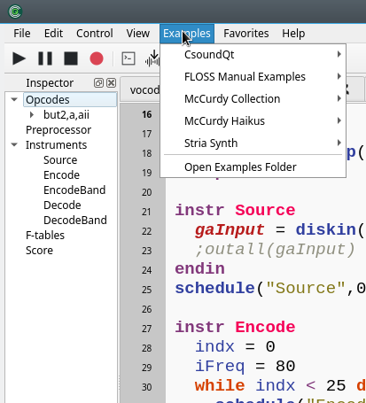
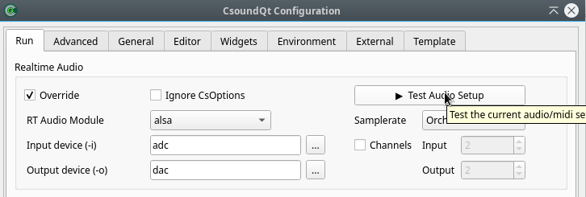
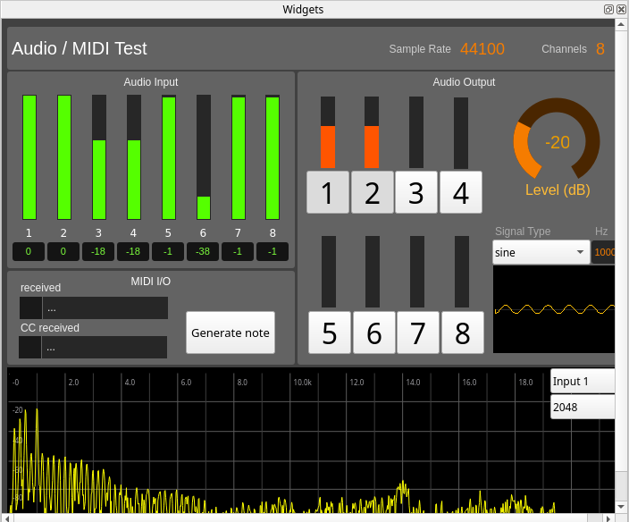
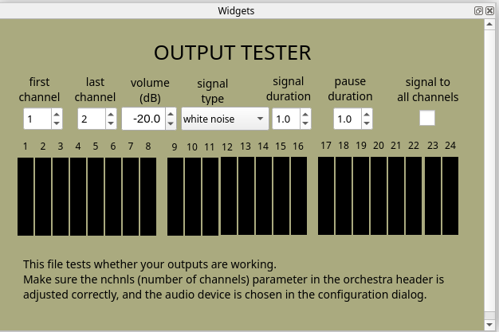
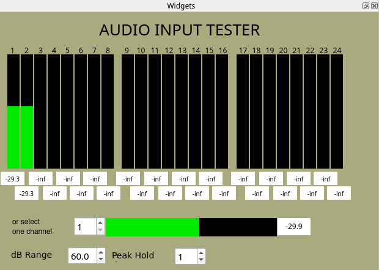
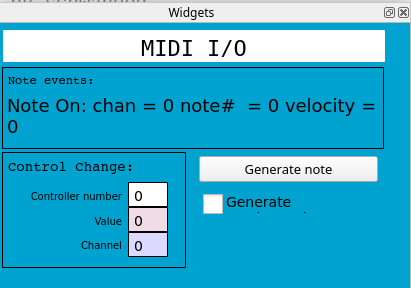
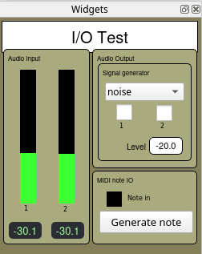
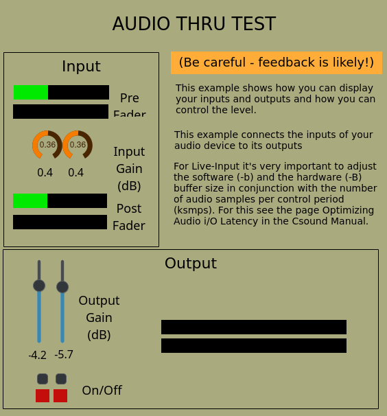

# 6. Exemples

CsoundQt arrive avec une riche et diverse collection d’exemples qui se trouvent dans le menu _Exemples_ :

## 6.1 Useful – Exemples utiles

Nous voulons ici mettre en lumière quelques exemples essentiels qui sont utiles pour tester l’audio et les connexions MIDI. Tous sont dans le dossier _Exemples > CsoundQt > Useful_.

### Test Audio/Midi

Il s’agit d’un exemple étendu qui teste toutes les fonctionnalités. Il peut aussi être lancé depuis le panneau _Configuration_ :

Cet exemple remplace en quelques sortes trois tests plus anciens pour la sortie audio, l’entrée audio et le test du MIDI, qui peuvent néanmoins rester utiles en raison de certaines fonctionnalités.

### Audio Output Test / Test des sorties audio

Ce fichier de test vérifie si vos sorties audio fonctionnent.

Assurez-vous que le paramètre nchnls (nombre de canaux) dans l’entête de l’orchestre est ajusté correctement, et que le périphérique audio est bien choisi dans la fenêtre de dialogue de la configuration.

### Audio Input Test / Test des entrées audio

### Midi IO test / Test des entrées et sorties MIDI

### IO Test / Test d’entrées et sorties stéréo

### Audio thru test

Teste la latence de votre configuration audio. (Vous pouvez ajuster la taille du tampon/buffer dans le [signet 'Advanced'](https://csoundqt.github.io/doc/config_advanced/) du panneau de configuration de Csound.)

Cet exemple montre comment vous pouvez afficher vos entrées et sorties et comment vous pouvez contrôler leur niveau.

Cet exemple connecte les entrées de votre périphérique audio aux sorties.

Pour des entrées en direct (live-input), il est très important d’ajuster la taille des tampon/buffer logiciel (-b) et tampon/buffer matériel (-B) en conjonction avec le nombre d’échantillons/samples audio par période de contrôle (ksmps). Pour en apprendre d’avantage à ce sujet, consultez la page consacrée à l’optimisation des latences audio i/o dans le manuel Csound.

## 6.2 Autres exemples

Vous trouverez deux grandes collections d’exemples inclus dans le menu Exemples :

- Les [exemples temps réel de Iain McCurdy](http://iainmccurdy.org/csound.html) qui furent à l’origine créés pour les widgets FLTK et ont été convertis pour CsoundQt par René.
- Les exemples provenant du [Manuel FLOSS de Csound](https://flossmanual.csound.com/).

Prenez plaisir à explorer ces exemples et d’autres. Les retours et suggestions pour une amélioration sont toujours les bienvenus !