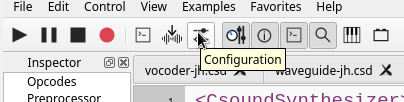
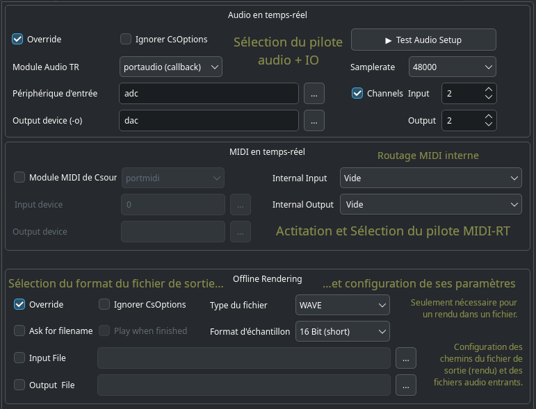
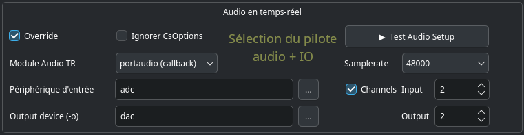
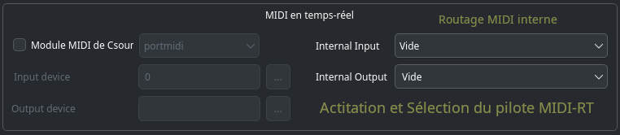
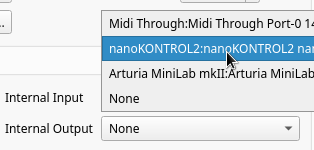
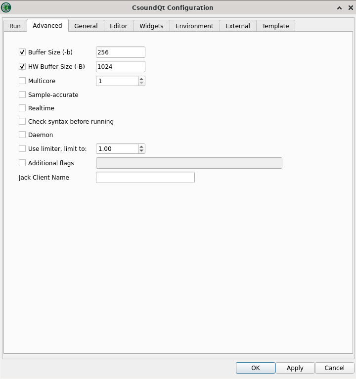
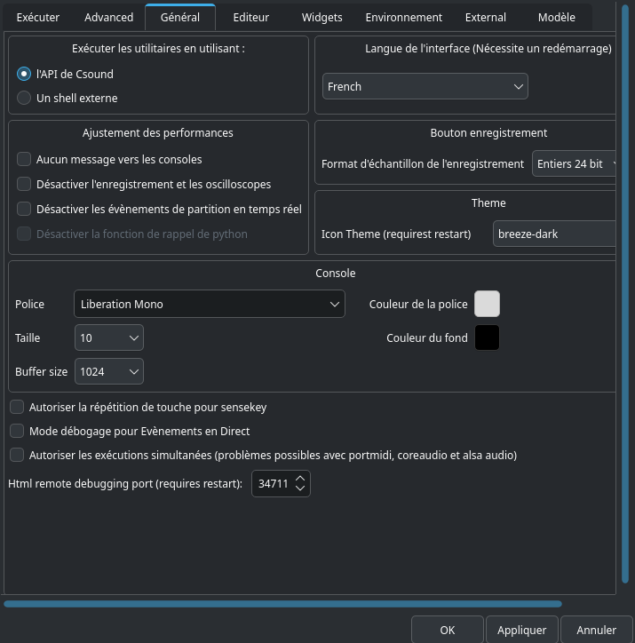
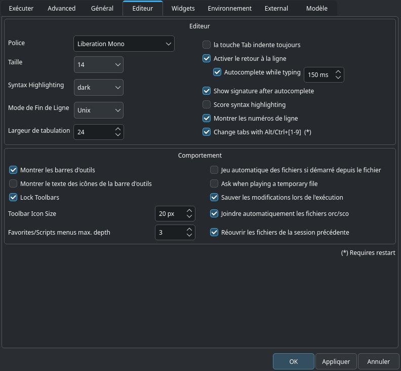
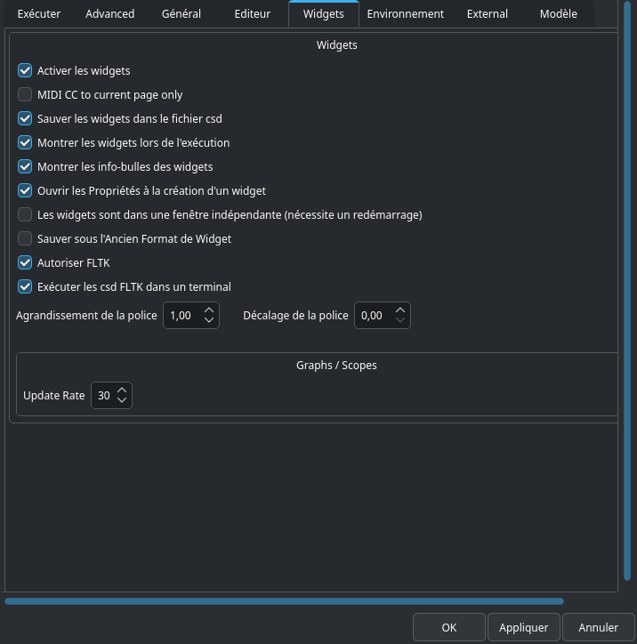

# Configuration de CsoundQt
## Introduction

Depuis son panneau de configuration, CsoundQt permet de configurer les [options Csound](http://csound.github.io/docs/manual/CommandFlags.html) les plus importantes, ainsi que de nombreux paramètres spécifiques à CsoundQt.

Pour ouvrir le panneau de configuration, pressez simplement le bouton _Configuration_, ou allez dans le menu _Edition > Configuration_. Le panneau de configuration comprend huit onglets. Les paramètres configurables présents dans chaque onglet sont décrit ci-dessous, onglet par onglet.



## Onglet _Exécuter_


Les paramètres en haut de l’onglet _Exécuter_ permettent à l’utilisateur de régler les options de la ligne de commande qui seront utilisées lors des invocations de Csound.

### Audio en temps réel



Ces option déterminent le comportement de CsoundQt quand vous pressez le bouton _Exécuter/Run_ (ou sélectionnez l’élément de menu _Contrôle > lancer Csound_).

- Sur la gauche, on trouve tous les paramètres de base pour la gestion de l’audio en temps réel.
- Cocher la case **Override** active les options CsoundQt configurées dans cette partie.
- Cocher la case **Ignorer CsOptions** permet d’ignorer les options intégrées entre les balises \<CsOptions>...\</CsOptions> du fichier cds exécuté.

NOTEZ que des précautions doivent être prises pour éviter les incohérences entre les options entre les balises \<CsOptions> et \</CsOptions>. Pour les débutantes, il est recommandé de désactiver les CsOptions quand les options CsoundQt sont activées. Si vous êtes un utilisateur plus expérimenté, vous pouvez laisser _Ignorer CsOptions_ non coché afin d’autoriser certaines options supplémentaires, comme _-m 128_ qui permet de réduire le volume d’impression de Csound.

#### Module RT Audio

Cette option dépend entièrement de votre système d’exploitation.  
Si vous expérimentez des plantages ou avez des problèmes de performances en temps réel, Cela vaut la peine d’expérimenter un autre module.

Les choix les plus courants sur les différents systèmes d’exploitation sont probablement :
- Pour Linux : l’utilisation de alsa ou jack.
- Pour OSX : l’utilisation de coreaudio ou portaudio.
- Pour Windows : l’utilisation de portaudio

#### Périphérique d’entrée

Cette option permet de sélectionner le périphérique à utiliser pour l’entrée audio en temps réel, par exemple depuis un microphone. (Notez que vous devez avoir coché "Override" si vous voulez que Csound utilise votre sélection).

- Le choix habituel et le plus stable est **adc**. Dans ce cas, Csound utilisera le périphérique que a été sélectionné par défaut par votre système d’exploitation.

- Si vous voulez utiliser un périphérique différent, cliquez sur le bouton à droite du champ `…`. Vous ouvrirez la liste des périphériques disponibles et pourrez en choisir un parmi eux.

- Si vous n’avez pas d’entrée temps réel, choisissez "**no input**".

> NOTE : Le module portaudio requière habituellement le même nombre de canaux entrants que de canaux sortants. Certains ordinateurs ont 2 canaux de sortie mais seulement une entrée microphone comportant un seul canal entrant. Dans ce cas, vous obtiendrez une erreur :
```
*** PortAudio: error: -9998: Invalid number of channels
```
Dans ce cas, utilisez `nchnls_i = 1` dans l’entête de votre csd, ou bien, si vous n’avez pas d’entrée live, configurez le champ _Périphérique d’entrée_ sur "No Input".

#### Périphérique de sortie

Cette option permet de sélectionner le périphérique à utiliser pour la sortie audio en temps réel. (Notez que vous devez avoir coché "Override" si vous voulez que Csound utilise votre sélection).

- Le choix habituel et le plus stable est **dac**. Dans ce cas, Csound utilisera le périphérique que a été sélectionné par défaut par votre système d’exploitation.

- Si vous voulez utiliser un périphérique différent, cliquez sur le bouton à droite du champ `…`. Vous ouvrirez la liste des périphériques disponibles et pourrez en choisir un parmi eux.

#### Test Audio

En haut à droite, on trouve un accès direct au test audio intégré, ainsi que quelques possibilités supplémentaires.

#### Samplerate / Taux d’échantillonnage

Généralement, Csound utilisera le taux d’échantillonnage défini dans le fichier .csd avec l’instruction `sr`. Si vous le préférez, vous pouvez le configurer ici et utiliser le taux d’échantillonnage du système ou une taux standard.

#### Canaux

Généralement, Csound utilisera le nombre de canaux défini dans le fichier .csd avec l’instruction `nchnls`. Si vous le préférez, vous pouvez le configurer ici pour les canaux entrant et sortant.

### Midi en temps réel



#### Module MIDI Csound

À gauche vous choisissez si vous voulez utiliser la gestion du MIDI intégrée à Csound, ou celle fournie par CsoundQt.

En général vous ne **cocherez pas** cette case vous voudrez utiliser le propre gestionnaire MIDI de CsoundQt (qui est [RtMidi](https://github.com/thestk/rtmidi/tree/master)).

Si vous choisissez d’utilisé plutôt le module MIDI intégré à Csound, vous ne pourrez pas connecter vos périphériques MIDI aux widgets de CsoundQt.

#### Internal Input

Si vous optez pour le gestionnaire MIDI interne de CsoundQt (en ne cochant pas la case "Module MIDI de Csound"), vous sélectionnez ici le périphérique MIDI à utiliser avec CsoundQt.



**Notez** que vous ne pouvez pas choisir plus d’un périphérique ici. Si vous voulez utiliser deux périphériques MIDI ou plus, vous devrez les mélanger via hardware ou logiciel.

#### Internal Output

Ceci n’est utile que si vous envoyez du MIDI vers un périphérique externe.

### Rendu hors ligne / offline rendering


Ces options déterminent le comportement de CsoundQt quand vous opérez le rendu d’un fichier (en pressant le bouton **Restituer dans un fichier** ou en sélectionnant l’élément de menu _Contrôle > Restituer dans un fichier)

#### Override

Cochez cette case pour activer les options configurées ici.

#### Ignorer CsOptions

Cochez la case **Ignorer CsOptions** pour ignorer les options intégrées entre les balises \<CsOptions>...\</CsOptions> du fichier csd à exécuter.

NOTEZ que des précautions doivent être prises pour éviter les incohérences entre les options entre les balises \<CsOptions> et \</CsOptions>. Pour les débutantes, il est recommandé de désactiver les CsOptions quand les options CsoundQt sont activées. Si vous êtes un utilisateur plus expérimenté, vous pouvez laisser _Ignorer CsOptions_ non coché afin d’autoriser certaines options supplémentaires, comme _-m 128_ qui permet de réduire le volume d’impression de Csound.

Notez que si vous cochez "Override" et n’avez pas coché "Ignorer CsOptions", s’il existe un conflit entre les options, les options configurées CsoundQt configurées dans ce panneau seront prioritaires.

#### Ask for filename / Demander un nom de fichier

Demandera un nom pour le fichier dans lequel sera rendue la performance. Il est conseillé aux débutants d’activer cette option. Sinon il peut arriver que vous écrasiez accidentellement un fichier existant.

#### Type du fichier – Format d’échantillon

À utiliser pour configurer le format du fichier de sortie.

#### Input filename / Nom du fichier entrant

Correspond au drapeau -i (input soundfile name).

#### Output filename / Nom du fichier sortant

Correspond au drapeau -o pour la définition du nom de fichier de sortie dans lequel le son est écrit.

## Onglet Advanced



Les deux première options sont importantes pour la configuration d’une performance en directe car la latence dépend d’eux en grande partie.

### Taille du tampon (-b)

Ceci définit la taille du tampon logiciel en échantillons/samples (correspond au drapeau -b).

Si vous ne cochez pas cette option, CsoundQt utilisera les réglages par défaut. Comme indiqué dans le [manuel Csound](https://csound.com/docs/manual/CommandFlags.html), ces réglages sont définis à 256 samples sur Linux, 1024 sur MacOS X, et 4096 sur Windows.

Si vous cochez et entrez une valeur personnalisée, voici quelques conseils :

- Utilisez toujours une valeur puissance de deux.
- Généralement, la taille du bloc [ksmps](http://csound.github.io/docs/manual/ksmps.html) vaut 1/4 ou 1/2 de la taille du tampon logiciel. Si vous utilisez les entrées et sortie en direct / live, il est plus efficace de configurer la taille du tampon logiciel comme un entier multiple de _ksmps_ ("full duplex audio").

- Parce que ça réduit la latence, utilisez de plus petites valeurs (par exemple 128) pour les performances en direct / live (en particulier avec des entrée en direct). Utilisez de plus grandes valeurs (par exemple 1024) dans les autres cas, par exemple pour jouer des fichiers audio.

### Taille du tampon HW (-B)

Ceci définit la taille du tampon matériel en échantillons/samples (correspond au drapeau -B).

Si vous ne cochez pas cette option, CsoundQt utilisera les réglages par défaut. Comme indiqué dans le [manuel Csound](https://csound.com/docs/manual/CommandFlags.html), ces réglages sont définis à 256 samples sur Linux, 1024 sur MacOS X, et 4096 sur Windows.

Si vous cochez et entrez une valeur personnalisée, voici quelques conseils :

- Utilisez toujours un entier multiple de la taille du tampon logiciel. Un rapport courant est : Taille du tampon matériel = 4 * Taille du tampon logiciel.
- Le rapport entre la taille du tampon logiciel et la taille du tampon matériel dépend du module audio<sup>1</sup>.

<sup>1</sup>Dans l’explication de Victor Lazzarini (email à Joachim Heintz du 19 mars 2013) :
1. Pour portaudio, -B n’est utilisé que pour suggérer une latence au backend, alors que -b est utilisé pour définir la taille actuelle du tampon.
2. Pour coreaudio, -B est utilisé pour la taille du tampon circulaire interne, et -b est utilisé pour la taille du tampon IO actuel.
3. Pour Jack, -B est utilisé pour déterminer le nombre de tampons utilisés en conjonction avec -b. num = (N + M + 1) / M. -b est la taille de chaque tampon.
4. Pour alsa, -B est la taille de la taille du tampon, -b est la taille de la période (un tampon est divisé en périodes).
5. Pour Pulse, -b est la taille actuelle du tampon passé au périphérique, -B n’est pas utilisé.  
En d’autres termes, -B n’est pas très significatif en 1, et pas utilisé en 5, mais a un rôle à jouer dans 2, 3 et 4, ce qui est fonctionnellement similaire.

### Multicore

Vous pouvez essayer d’augmenter ceci au cas où vous atteignez les limites en calcul temps réel. Ça peut aider… ou pas. Cela dépend beaucoup de votre code.

### Sample-accurate / Précision à l’échantillon

Active le mode sample-accurate. Dans ce mode, le rendu n’est pas quantifié par rapport aux cycles de performance, mais commence à l’échantillon spécifié correspondant au moment du début d’un évènement.

### Realtime / Temps réel

Mode priorité au temps réel. Dans ce mode, toute initialisation (chargement de tampons, etc) est fait en tache de fond. L’instrument planifié commence son exécution quand les taches de fond sont terminées. Ce qui peut aider à éliminer les interruptions (mais peut avoir un effet négatif sur la précision de la planification). **NB: En mode temps réel, toutes les impression sont faites sur stderr**. Afin de voir l’effet des opcodes d’impression, ouvrez CsoundQt depuis la ligne de commande. Toutes les impression seront visibles sur le terminal.

### Vérifier la syntaxe avant d’exécuter

Dans certains cas, csound peut planter (et CsoundQT avec lui) avant que la moindre information de débogage soit lisible dans la console CsoundQt (pendant la compilation). Dans ces cas, activez cette option pour vérifier la syntaxe avant d’exécuter csound avec une communication complète avec les widgets, etc.

### Démon / Daemon

N’arrête pas si l’orchestre du csd n’est pas donné, est vide ou ne compile pas.  
NB : à utiliser avec précautions. Dans le cas d’erreur de syntaxe, Csound maintiendra l’exécution dans un état parfois indéfini, provoquant de plantages et éventuellement entrainant la chute de CsoundQt.  
NB2 : En l’absence de partition/score ou de tout évènement dans les balise \<CsScore>, Csound passe en mode daemon par défaut.

### Use Limiter / Additional flags / Jack Client Name

Ces option se comprennent d’elles-même.

## Onglet Général



Ces réglages se comprennent d’eux-mêmes.

## Onglet Éditeur



Seule une option nécessite quelques explication :

### Jeu automatique des fichiers si démarré depuis le fichier.

Si coché, un fichier csd sera joué immédiatement après son ouverture.

## Onglet Widgets

