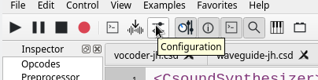

# Configuration de CsoundQt
## Introduction

Depuis son panneau de configuration, CsoundQt permet de configurer les [options Csound](http://csound.github.io/docs/manual/CommandFlags.html) les plus importantes, ainsi que de nombreux paramètres spécifiques à CsoundQt.

Pour ouvrir le panneau de configuration, pressez simplement le bouton _Configuration_, ou allez dans le menu _Edition > Configuration_. Le panneau de configuration comprend huit onglets. Les paramètres configurables présents dans chaque onglet sont décrit ci-dessous, onglet par onglet.

