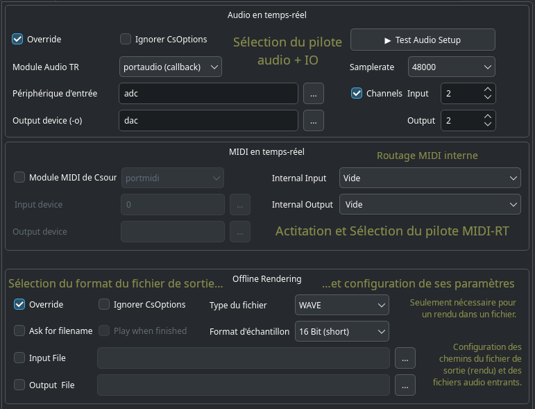
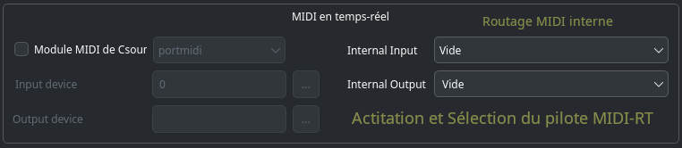
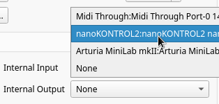

# Onglet _Exécuter_


Les paramètres en haut de l’onglet _Exécuter_ permettent à l’utilisateur de régler les options de la ligne de commande qui seront utilisées lors des invocations de Csound.

## Audio en temps réel


Ces option déterminent le comportement de CsoundQt quand vous pressez le bouton _Exécuter/Run_ (ou sélectionnez l’élément de menu _Contrôle > lancer Csound_).

- Sur la gauche, on trouve tous les paramètres de base pour la gestion de l’audio en temps réel.
- Cocher la case **Override** active les options CsoundQt configurées dans cette partie.
- Cocher la case **Ignorer CsOptions** permet d’ignorer les options intégrées entre les balises \<CsOptions>...\</CsOptions> du fichier cds exécuté.

NOTEZ que des précautions doivent être prises pour éviter les incohérences entre les options entre les balises \<CsOptions> et \</CsOptions>. Pour les débutantes, il est recommandé de désactiver les CsOptions quand les options CsoundQt sont activées. Si vous êtes un utilisateur plus expérimenté, vous pouvez laisser _Ignorer CsOptions_ non coché afin d’autoriser certaines options supplémentaires, comme _-m 128_ qui permet de réduire le volume d’impression de Csound.

### Module RT Audio

Cette option dépend entièrement de votre système d’exploitation.  
Si vous expérimentez des plantages ou avez des problèmes de performances en temps réel, Cela vaut la peine d’expérimenter un autre module.

Les choix les plus courants sur les différents systèmes d’exploitation sont probablement :
- Pour Linux : l’utilisation de alsa ou jack.
- Pour OSX : l’utilisation de coreaudio ou portaudio.
- Pour Windows : l’utilisation de portaudio

### Périphérique d’entrée

Cette option permet de sélectionner le périphérique à utiliser pour l’entrée audio en temps réel, par exemple depuis un microphone. (Notez que vous devez avoir coché "Override" si vous voulez que Csound utilise votre sélection).

- Le choix habituel et le plus stable est **adc**. Dans ce cas, Csound utilisera le périphérique que a été sélectionné par défaut par votre système d’exploitation.

- Si vous voulez utiliser un périphérique différent, cliquez sur le bouton à droite du champ `…`. Vous ouvrirez la liste des périphériques disponibles et pourrez en choisir un parmi eux.

- Si vous n’avez pas d’entrée temps réel, choisissez "**no input**".

> NOTE : Le module portaudio requière habituellement le même nombre de canaux entrants que de canaux sortants. Certains ordinateurs ont 2 canaux de sortie mais seulement une entrée microphone comportant un seul canal entrant. Dans ce cas, vous obtiendrez une erreur :
```
*** PortAudio: error: -9998: Invalid number of channels
```
Dans ce cas, utilisez `nchnls_i = 1` dans l’entête de votre csd, ou bien, si vous n’avez pas d’entrée live, configurez le champ _Périphérique d’entrée_ sur "No Input".

### Périphérique de sortie

Cette option permet de sélectionner le périphérique à utiliser pour la sortie audio en temps réel. (Notez que vous devez avoir coché "Override" si vous voulez que Csound utilise votre sélection).

- Le choix habituel et le plus stable est **dac**. Dans ce cas, Csound utilisera le périphérique que a été sélectionné par défaut par votre système d’exploitation.

- Si vous voulez utiliser un périphérique différent, cliquez sur le bouton à droite du champ `…`. Vous ouvrirez la liste des périphériques disponibles et pourrez en choisir un parmi eux.

### Test Audio

En haut à droite, on trouve un accès direct au test audio intégré, ainsi que quelques possibilités supplémentaires.

### Samplerate / Taux d’échantillonnage

Généralement, Csound utilisera le taux d’échantillonnage défini dans le fichier .csd avec l’instruction `sr`. Si vous le préférez, vous pouvez le configurer ici et utiliser le taux d’échantillonnage du système ou une taux standard.

### Canaux

Généralement, Csound utilisera le nombre de canaux défini dans le fichier .csd avec l’instruction `nchnls`. Si vous le préférez, vous pouvez le configurer ici pour les canaux entrant et sortant.

## Midi en temps réel



### Module MIDI Csound

À gauche vous choisissez si vous voulez utiliser la gestion du MIDI intégrée à Csound, ou celle fournie par CsoundQt.

En général vous ne **cocherez pas** cette case vous voudrez utiliser le propre gestionnaire MIDI de CsoundQt (qui est [RtMidi](https://github.com/thestk/rtmidi/tree/master)).

Si vous choisissez d’utilisé plutôt le module MIDI intégré à Csound, vous ne pourrez pas connecter vos périphériques MIDI aux widgets de CsoundQt.

### Internal Input

Si vous optez pour le gestionnaire MIDI interne de CsoundQt (en ne cochant pas la case "Module MIDI de Csound"), vous sélectionnez ici le périphérique MIDI à utiliser avec CsoundQt.



**Notez** que vous ne pouvez pas choisir plus d’un périphérique ici. Si vous voulez utiliser deux périphériques MIDI ou plus, vous devrez les mélanger via hardware ou logiciel.

### Internal Output

Ceci n’est utile que si vous envoyez du MIDI vers un périphérique externe.

## Rendu hors ligne / offline rendering


Ces options déterminent le comportement de CsoundQt quand vous opérez le rendu d’un fichier (en pressant le bouton **Restituer dans un fichier** ou en sélectionnant l’élément de menu _Contrôle > Restituer dans un fichier)

### Override

Cochez cette case pour activer les options configurées ici.

### Ignorer CsOptions

Cochez la case **Ignorer CsOptions** pour ignorer les options intégrées entre les balises \<CsOptions>...\</CsOptions> du fichier csd à exécuter.

NOTEZ que des précautions doivent être prises pour éviter les incohérences entre les options entre les balises \<CsOptions> et \</CsOptions>. Pour les débutantes, il est recommandé de désactiver les CsOptions quand les options CsoundQt sont activées. Si vous êtes un utilisateur plus expérimenté, vous pouvez laisser _Ignorer CsOptions_ non coché afin d’autoriser certaines options supplémentaires, comme _-m 128_ qui permet de réduire le volume d’impression de Csound.

Notez que si vous cochez "Override" et n’avez pas coché "Ignorer CsOptions", s’il existe un conflit entre les options, les options configurées CsoundQt configurées dans ce panneau seront prioritaires.

### Ask for filename / Demander un nom de fichier

Demandera un nom pour le fichier dans lequel sera rendue la performance. Il est conseillé aux débutants d’activer cette option. Sinon il peut arriver que vous écrasiez accidentellement un fichier existant.

### Type du fichier – Format d’échantillon

À utiliser pour configurer le format du fichier de sortie.

### Input filename / Nom du fichier entrant

Correspond au drapeau -i (input soundfile name).

### Output filename / Nom du fichier sortant

Correspond au drapeau -o pour la définition du nom de fichier de sortie dans lequel le son est écrit.