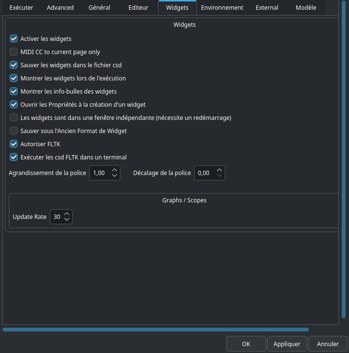

# Onglet Widgets

## Activer les Widgets
Si décoché, nous ne pourrez pas utiliser les widgets de CsoundQt.

## Sauver les widgets dans le fichier csd
Chaque fichier csd comprend une section pour les widgets et les préréglages/presets. Ces sections sont cachées quand vous ouvrez votre fichier csd dans CsoundQt, mais sont visibles dans n’importe quel éditeur de texte. Si cette option est décochée, vous ne verrez donc aucun widget la prochaine fois que vous ouvrirez votre csd. Cette option n’est donc utile que si vous voulez exporter un fichier csd sans ses widgets.

## Montrer les widgets lors de l’exécution
Si coché, le panneau widget s’ouvrira à chaque appui sur le bouton Play.

## Montrer les info-bulles des widgets
Active une fonctionnalité utile qui vous permet de voir le nom du canal d’un widget quand vous laissez un instant le pointeur de votre souris au-dessus.

## Active FLTK
[FLTK](http://csound.github.io/docs/manual/ControlFltkIntro.html) désigne une méthode intégrée (et quelque peu absolète) d’utilisation des widgets dans Csound. Comme ces widgets peuvent entrer en conflit avec ceux de CsoundQt, il est généralement préférable de décocher cette option.

## Ouvrir les propriétés à la création d’un widget
Vous laisserez généralement cette option cochée, afin de définir le nom de votre canal ainsi que d’autres propriétés quand vous créez un widget.

## Les widgets sont dans une fenêtre indépendante (nécessite un redémarrage)
Excepté le panneau principal de l’Éditeur, CsoundQt est composé de nombreuses sous-fenêtres : La Console de sortie, le panneau d’Aide, l’Inspecteur, et ainsi de suite. Si vous cochez cette option, le panneau Widget ne sera donc pas considéré comme une sous-fenêtre, mais comme une fenêtre indépendante. Ça signifie que vous ne pourrez pas l’ancrer en double-cliquant sur son entête. Mais Ceci peut avoir des avantages, selon votre système et votre configuration.

## Agrandissement de la police + Décalage de la police
Affecte la façon dont les polices sont affichées, par exemple dans un widget Label.