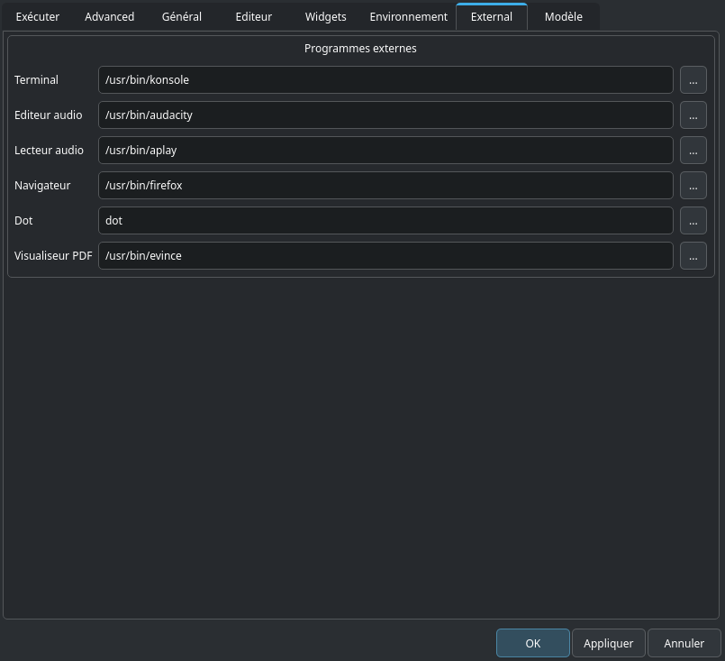

# Onglet Environnement

On trouve quelques paramètres importants ici, ainsi que d’autres uniquement destinés aux développeurs. Nous nous concentrerons ici sur les  options qui peuvent intéresser tous les utilisateurs.

## Répertoire de la doc html
Définit le dossier contenant le Canonical Csound Manual. Si – en choisissant _vue > panneau d’aide_, vous ne voyez ne voyez rien à part un message comme "not found!", vous devrez définir ici le chemin vers le dossier du manuel. Cliquez sur le bouton à droite du champ et choisissez le dossier contenant le manuel sur votre ordinateur.

## SADIR (Sound Analysis Directory)
Vous pouvez définir ici le dossier dans lequel Csound cherchera les fichiers d’analyse, comme les fichiers de type _.pvx_.

## SSDIR (Sound Sample Directory)
Il est très utile de définir un dossier pour les échantillons sonores, par exemple quand on utilise [diskin](http://csound.github.io/docs/manual/diskin.html). Vous pouvez alors vous référer à un échantillon seulement par son nom.

## SFDIR (Sound File Directory)
Définit un dossier pour le fichiers de sortie. Ceci est généralement déjà défini dans l’onglet Exécuter, comme expliqué [ici](01-run-tab.md) (Nom du fichier de sortie).

## INCDIR (Include Directory)
Définit un dossier pour les fichiers qui peuvent être appelés par l’instruction [#include](https://csound.com/docs/manual-fr/include.html)

## Répertoire favori
Définit un dossier qui apparaitra sous l’entrée du menu _Favoris_.

## Répertoire de script Python
Vous laisserez généralement ce champ vide afin de laisser CsoundQt accéder à ses propres scripts Python. À spécifier uniquement su vous construisez CsoundQt, ou voulez modifier le répertoire des scripts.