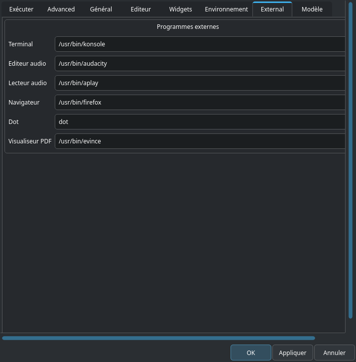

# Onglet External

Ces option ne nécessitent pas d’explications. Sauf l’option _Dot_ qui est un exécutable provenant de https://www.graphviz.org, utilisé dans CsoundQt pour visualiser le graphique du code (_Vue > Voir le graphique du code).